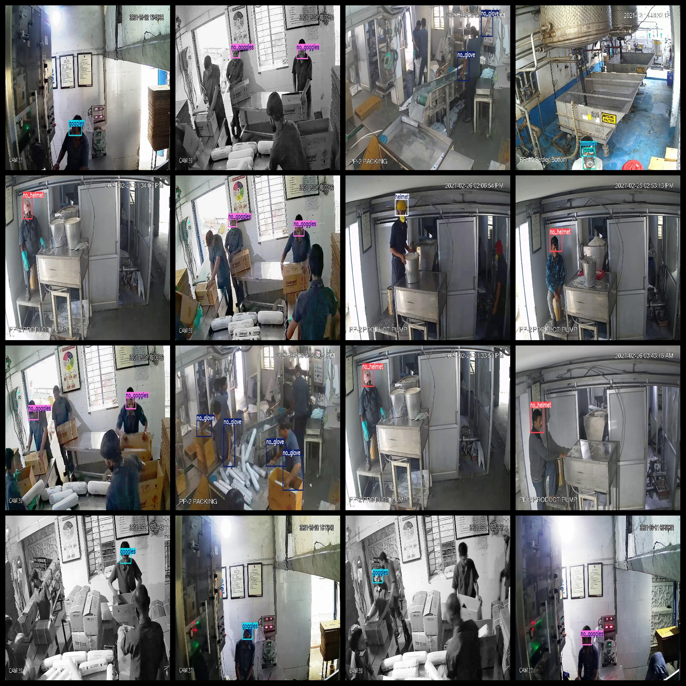
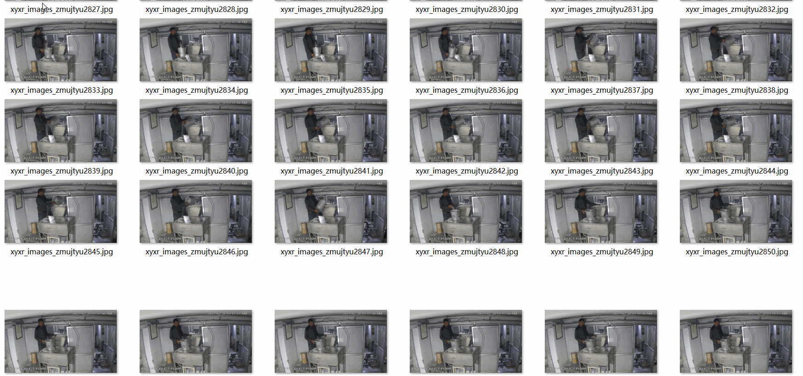

# Industrial Safety Pieces Person Protection Detection Dataset 11455 images VOC+YOLO format

The industrial safety personal protective equipment detection dataset contains 11455 VOC+YOLO format images.

Dataset Format: Pascal VOC + YOLO (excluding the split-path txt file; only jpg images with corresponding VOC-format xml files and YOLO-format txt files)

Number of images (number of jpg files): 11455

Number of XML files: 11455

Marked number (txt file count): 11455

Number of categories: 10

The Github repository is: datasets_sl

["glove", "goggles", "helmet", "mask", "no_glove", "no_goggles", "no_helmet", "no_mask", "no_shoes", "shoes"]

Label Chinese translation: glove (gloves), goggles (goggles), helmet (helmet), mask (mask), no_glove (no gloves), no_goggles (no goggles), no_helmet (no helmet), no_mask (no mask), no_shoes (no shoes/barefoot), shoes (shoes)

Number of boxes labeled in each category:

glove frame count = 4663

goggles frame count = 4184

helmet frame count = 906

mask frame count = 269

no_glove frame count = 6126

no_goggles frame count = 4092

no_helmet frame count = 1090

no_mask frame count = 661

no_shoes frame count = 606

shoes frame count = 755

Total number of frames: 23352

Number of images per category:

Glove has 2107 images.

Goggles have 3796 images.

Helmets owning images = 906

Mask ownership count = 269

NoGlove has 2789 images.

No_goggles owns 3260 images.

No_helmet has 984 images.

No_mask_occupies_661

No_shoes_occupy_photos_count = 345

Shoes occupy 406 pictures.

Image resolution: 1280x720

Use the labeling tool: labelImg

Dataset Enhancing: No (The dataset is a video screenshot labeled, details can be consulted)

Rules for annotation: Draw a rectangle around the category.

Important note: The dataset does not have been divided into training, validation, and testing sets.

Special Disclaimer: This dataset does not guarantee the accuracy of the trained models or weight files.

Preserve the original meaning, format markers (【】『』「」<>[]), numbers, English words, and special characters as-is. Output ONLY the English translation, no explanations, no quotes.
## Images

---

Here is a pay link on Stripe (https://buy.stripe.com/3cs8yP7sY87d0vu9AB). Please contact me lonlonago@foxmail.com after funding $89, and I will send you a complete data files, thank you!

